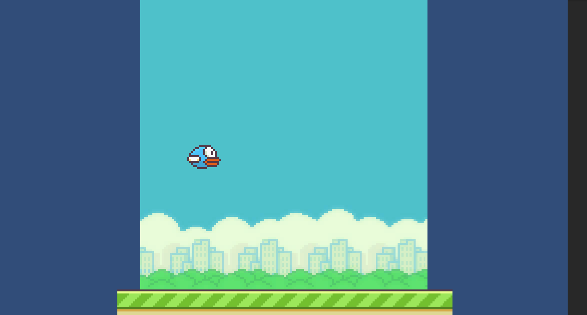

# portfolio1

。グエン　ティ　ガン
。専門学校デジタルアーツ東　ゲーム学科	ゲームプログラム

# スキル
。Java

。SQL

。HTML/CSS

。JAVASCRIPT

。C#

。C/C++

## 取り組んでるテーマ
	C を使った簡単プログラム

## 作品リスト

## 操作方法
	。ジャンプ: Spacebarでジャンプします。
	。スコア: プレイヤーは障害物を避けたり、スコアを獲得します。

