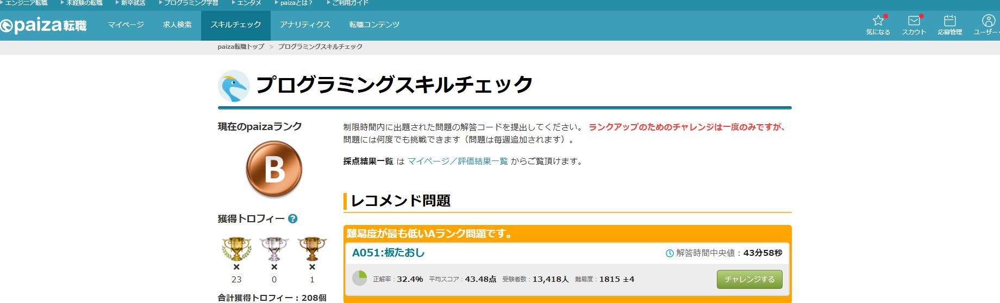
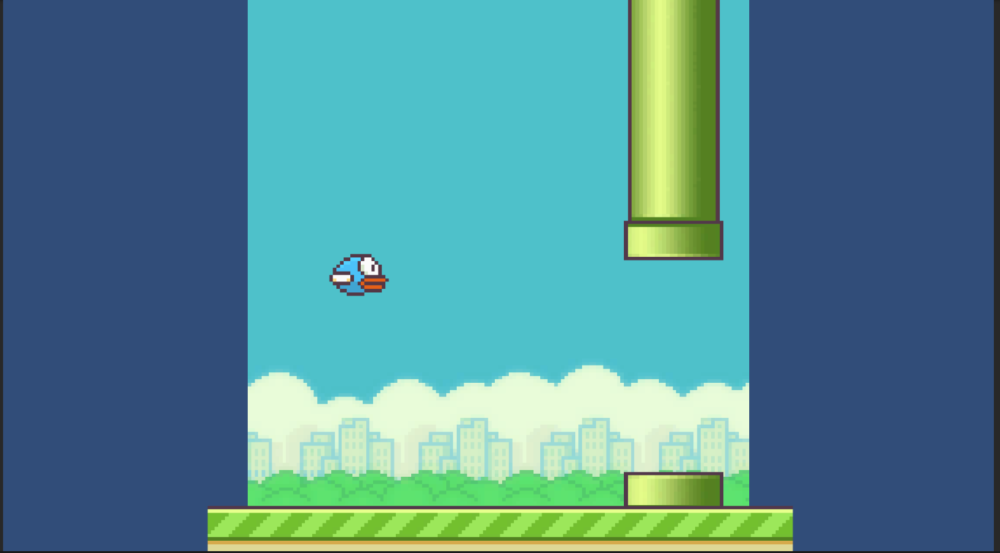

<body style="background-image:url('img00.jpg');background-size:cover;"></body>

 Portfolio1

- グエン　ティ　ガン

- 専門学校デジタルアーツ東　ゲーム学科	ゲームプログラム

# 
スキル

<b1>プログラム言語</b1>

- Java

	PaizaでのJava練習

- SQL

- HTML/CSS

- JAVASCRIPT

- C#

- C/C++

<b1>データベース</b1>

- MySQL

# 
取り組んでるテーマ

	C を使った簡単プログラム

# 
作品リスト

# 
操作方法

- ジャンプ: Spacebarでジャンプします。
- スコア: プレイヤーは障害物を避けたり、スコアを獲得します。

# 
連絡先

- Gmail <ngannguyen2509.dat@gmail.com>

